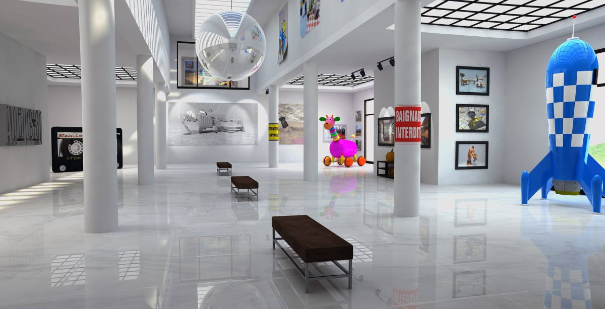

# Community Science Museum



This was my semester project on Noroff. The brief stated:
An interactive science museum called the Community Science Museum is opening in your town/city. Its core target audience is primary and middle school children (ages 7-15) and families with young children. The museum wants an informative, appealing website to attract middle school pupils and their parents. The site should appeal to youngsters without pandering; it should take for granted that the audience is curious and intelligent. The website should be informative and engaging, encouraging viewers to visit the museum. The website should be responsive and easy to use on various devices.

## Description

Given the brief, i spent quite some time on the design, the challenge was to make such a text heavy site easily scannable for the target audience. I spent some time shaving down the supplied content to be as consize as i could, then i spread the content over what i thought was a logical page tree.

The focus of the page was to be

- Responsive
- Accessible
- Aesthetically pleasing

## Built With

- Javascript
- CSS
- HTML

## Getting Started

### Installing

1. Clone the repo:

```bash
git clone https://github.com/Jarle302/Noroff-sp1-Jarle.git
```

2. Install the dependencies:

```
There are no dependencies!
```

### Running

```
Link to live site: https://sweet-gumption-216664.netlify.app/index.html
```

## Contributing

If you want to help make the site even better, open a pull request and i will review your changes, thanks in advance!

## Contact

[My email](jarlehtollaksen2@live.no)

[My facebook page](https://www.facebook.com/jarle.tollaksen.3/)
